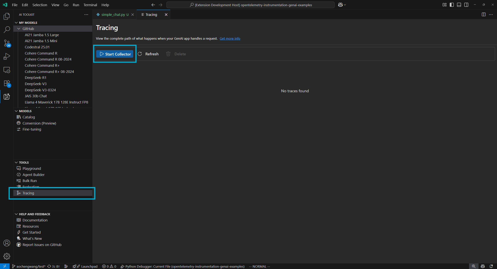
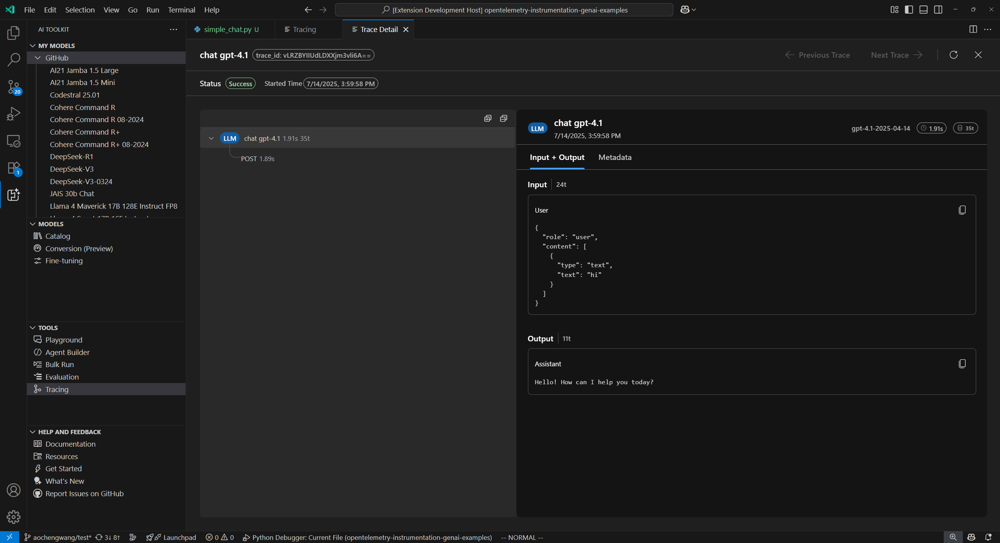

# Tracing

AI Toolkit hosts a local HTTP and gRPC server to collect trace data. The collector server is compatible with OTLP (OpenTelemetry Protocol) and most language model SDKs either directly support OTLP or have third-party instrumentation libraries to support it. After collecting the instrumentation data, AI Toolkit provides a friendly UI to visualize the data.

All frameworks or SDKs that support OTLP and follow [semantic conventions for generative AI systems](https://opentelemetry.io/docs/specs/semconv/gen-ai/) are supported. The following table contains common AI SDKs that we have tested.

| | Azure AI Inference | Azure AI Foundry Agents Service | Anthropic | Gemini | LangChain | OpenAI SDK | OpenAI Agents SDK |
|---|---|---|---|---|---|---|---|
| **Python** | ✅ | ✅ | ✅ ([traceloop](https://github.com/traceloop/openllmetry))<sub>1,2</sub> | ✅  | ✅ ([LangSmith](https://github.com/langchain-ai/langsmith-sdk))<sub>1,2</sub> | ✅ ([opentelemetry-python-contrib](https://github.com/open-telemetry/opentelemetry-python-contrib))<sub>1</sub> | ✅ ([Logfire](https://github.com/pydantic/logfire))<sub>1,2</sub>  |
| **TS/JS** | ✅ | ✅ | ✅ ([traceloop](https://github.com/traceloop/openllmetry))<sub>1,2</sub>| ❌ |✅ ([traceloop](https://github.com/traceloop/openllmetry))<sub>1,2</sub> |✅ ([traceloop](https://github.com/traceloop/openllmetry))<sub>1,2</sub>|❌|

> 1. The SDKs in brackets are third-party SDKs to support OTLP instrumentation. They are used because the official SDKs don't support OTLP.
> 2. These instrumentation SDKs don't strictly adhere to the OpenTelemetry semantic conventions for generative AI systems.

## How to Get Started with Tracing

1. Select **Tracing** in the tree view to open the tracing webview and click **Start Collector** button to start the local OTLP trace collector server.



2. Add a code snippet to your AI app to enable instrumentation. See the [Set up instrumentation](#set-up-instrumentation) section for code snippets for different languages and SDKs.

3. Run your app to generate trace data.

4. Click the **Refresh** button in the tracing webview to see new trace data.


## Set up Instrumentation

<details>
<summary>Azure AI Inference SDK - Python</summary>

**Installation:**
```bash
pip install opentelemetry-sdk opentelemetry-exporter-otlp-proto-http azure-ai-inference[opentelemetry]
```

**Setup:**
```python
import os
os.environ["AZURE_TRACING_GEN_AI_CONTENT_RECORDING_ENABLED"] = "true"
os.environ["AZURE_SDK_TRACING_IMPLEMENTATION"] = "opentelemetry"

from opentelemetry.sdk.resources import Resource
from opentelemetry.sdk.trace import TracerProvider
from opentelemetry.sdk.trace.export import BatchSpanProcessor
from opentelemetry.exporter.otlp.proto.http.trace_exporter import OTLPSpanExporter

resource = Resource(attributes={
    "service.name": "opentelemetry-instrumentation-azure-ai-agents"
})
provider = TracerProvider(resource=resource)
otlp_exporter = OTLPSpanExporter(
    endpoint="http://localhost:4318/v1/traces",
)
processor = BatchSpanProcessor(otlp_exporter)
provider.add_span_processor(processor)
trace.set_tracer_provider(provider)

from azure.ai.inference.tracing import AIInferenceInstrumentor
AIInferenceInstrumentor().instrument(True)
```
</details>


<details>
<summary>Azure AI Inference SDK - TypeScript/JavaScript</summary>

**Installation:**
```bash
npm install @azure/opentelemetry-instrumentation-azure-sdk @opentelemetry/api @opentelemetry/exporter-trace-otlp-proto @opentelemetry/instrumentation @opentelemetry/resources @opentelemetry/sdk-trace-node
```

**Setup:**
```javascript
const { context } = require("@opentelemetry/api");
const { resourceFromAttributes } = require("@opentelemetry/resources");
const {
  NodeTracerProvider,
  SimpleSpanProcessor,
} = require("@opentelemetry/sdk-trace-node");
const { OTLPTraceExporter } = require('@opentelemetry/exporter-trace-otlp-proto');

const exporter = new OTLPTraceExporter({
    url: "http://localhost:4318/v1/traces",
});
const provider = new NodeTracerProvider({
    resource: resourceFromAttributes({
        "service.name": "opentelemetry-instrumentation-azure-ai-inference",
    }),
    spanProcessors: [
        new SimpleSpanProcessor(exporter)
    ],
});
provider.register();

const { registerInstrumentations } = require("@opentelemetry/instrumentation");
const { createAzureSdkInstrumentation } = require("@azure/opentelemetry-instrumentation-azure-sdk");

registerInstrumentations({
  instrumentations: [createAzureSdkInstrumentation()],
});
```
</details>

<details>
<summary>Azure AI Foundry Agent Service - Python</summary>

**Installation:**
```bash
pip install opentelemetry-sdk opentelemetry-exporter-otlp-proto-http azure-ai-inference[opentelemetry]
```

**Setup:**
```python
import os
os.environ["AZURE_TRACING_GEN_AI_CONTENT_RECORDING_ENABLED"] = "true"
os.environ["AZURE_SDK_TRACING_IMPLEMENTATION"] = "opentelemetry"

from opentelemetry.sdk.resources import Resource
from opentelemetry.sdk.trace import TracerProvider
from opentelemetry.sdk.trace.export import BatchSpanProcessor
from opentelemetry.exporter.otlp.proto.http.trace_exporter import OTLPSpanExporter

resource = Resource(attributes={
    "service.name": "opentelemetry-instrumentation-azure-ai-agents"
})
provider = TracerProvider(resource=resource)
otlp_exporter = OTLPSpanExporter(
    endpoint="http://localhost:4318/v1/traces",
)
processor = BatchSpanProcessor(otlp_exporter)
provider.add_span_processor(processor)
trace.set_tracer_provider(provider)

from azure.ai.agents.telemetry import AIAgentsInstrumentor
AIAgentsInstrumentor().instrument(True)
```
</details>

<details>
<summary>Azure AI Foundry Agent Service - TypeScript/JavaScript</summary>

**Installation:**
```bash
npm install @azure/opentelemetry-instrumentation-azure-sdk @opentelemetry/api @opentelemetry/exporter-trace-otlp-proto @opentelemetry/instrumentation @opentelemetry/resources @opentelemetry/sdk-trace-node
```

**Setup:**
```javascript
const { context } = require("@opentelemetry/api");
const { resourceFromAttributes } = require("@opentelemetry/resources");
const {
  NodeTracerProvider,
  SimpleSpanProcessor,
} = require("@opentelemetry/sdk-trace-node");
const { OTLPTraceExporter } = require('@opentelemetry/exporter-trace-otlp-proto');

const exporter = new OTLPTraceExporter({
    url: "http://localhost:4318/v1/traces",
});
const provider = new NodeTracerProvider({
    resource: resourceFromAttributes({
        "service.name": "opentelemetry-instrumentation-azure-ai-inference",
    }),
    spanProcessors: [
        new SimpleSpanProcessor(exporter)
    ],
});
provider.register();

const { registerInstrumentations } = require("@opentelemetry/instrumentation");
const { createAzureSdkInstrumentation } = require("@azure/opentelemetry-instrumentation-azure-sdk");

registerInstrumentations({
  instrumentations: [createAzureSdkInstrumentation()],
});
```
</details>

<details>
<summary>Anthropic - Python</summary>

**Installation:**
```bash
pip install opentelemetry-sdk opentelemetry-exporter-otlp-proto-http opentelemetry-instrumentation-anthropic
```

**Setup:**
```python
from opentelemetry import trace
from opentelemetry.sdk.resources import Resource
from opentelemetry.sdk.trace import TracerProvider
from opentelemetry.sdk.trace.export import BatchSpanProcessor
from opentelemetry.exporter.otlp.proto.http.trace_exporter import OTLPSpanExporter

resource = Resource(attributes={
    "service.name": "opentelemetry-instrumentation-anthropic-traceloop"
})
provider = TracerProvider(resource=resource)
otlp_exporter = OTLPSpanExporter(
    endpoint="http://localhost:4318/v1/traces",
)
processor = BatchSpanProcessor(otlp_exporter)
provider.add_span_processor(processor)
trace.set_tracer_provider(provider)

from opentelemetry.instrumentation.anthropic import AnthropicInstrumentor
AnthropicInstrumentor().instrument()
```
</details>

<details>
<summary>Anthropic - TypeScript/JavaScript</summary>

**Installation:**
```bash
npm install @traceloop/node-server-sdk
```

**Setup:**
```javascript
const { initialize } = require("@traceloop/node-server-sdk");
const { trace } = require("@opentelemetry/api");

initialize({
    appName: "opentelemetry-instrumentation-anthropic-traceloop",
    baseUrl: "http://localhost:4318",
    disableBatch: true,
});
```
</details>

<details>
<summary>Google Gemini - Python</summary>

**Installation:**
```bash
pip install opentelemetry-sdk opentelemetry-exporter-otlp-proto-http opentelemetry-instrumentation-google-genai
```

**Setup:**
```python
from opentelemetry import trace
from opentelemetry.sdk.resources import Resource
from opentelemetry.sdk.trace import TracerProvider
from opentelemetry.sdk.trace.export import BatchSpanProcessor
from opentelemetry.exporter.otlp.proto.http.trace_exporter import OTLPSpanExporter

resource = Resource(attributes={
    "service.name": "opentelemetry-instrumentation-google-genai"
})
provider = TracerProvider(resource=resource)
otlp_exporter = OTLPSpanExporter(
    endpoint="http://localhost:4318/v1/traces",
)
processor = BatchSpanProcessor(otlp_exporter)
provider.add_span_processor(processor)
trace.set_tracer_provider(provider)

from opentelemetry.instrumentation.google_genai import GoogleGenAiSdkInstrumentor
GoogleGenAiSdkInstrumentor().instrument(enable_content_recording=True)
```
</details>

<details>
<summary>LangChain - Python</summary>

**Installation:**
```bash
pip install langsmith[otel]
```

**Setup:**
```python
import os
os.environ["LANGSMITH_OTEL_ENABLED"] = "true"
os.environ["LANGSMITH_TRACING"] = "true"
os.environ["OTEL_EXPORTER_OTLP_ENDPOINT"] = "http://localhost:4318"
```
</details>

<details>
<summary>LangChain - TypeScript/JavaScript</summary>

**Installation:**
```bash
npm install @traceloop/node-server-sdk
```

**Setup:**
```javascript
const { initialize } = require("@traceloop/node-server-sdk");
initialize({
    appName: "opentelemetry-instrumentation-langchain-traceloop",
    baseUrl: "http://localhost:4318",
    disableBatch: true,
});
```
</details>

<details>
<summary>OpenAI - Python</summary>

**Installation:**
```bash
pip install opentelemetry-sdk opentelemetry-exporter-otlp-proto-http opentelemetry-instrumentation-openai-v2
```

**Setup:**
```python
from opentelemetry import trace
from opentelemetry.exporter.otlp.proto.http.trace_exporter import OTLPSpanExporter
from opentelemetry.sdk.trace import TracerProvider
from opentelemetry.sdk.trace.export import BatchSpanProcessor
from opentelemetry.instrumentation.openai_v2 import OpenAIInstrumentor

# Set up tracer provider
trace.set_tracer_provider(TracerProvider())

# Configure OTLP exporter
otlp_exporter = OTLPSpanExporter(
    endpoint="http://localhost:4318/v1/traces"
)

# Add span processor
trace.get_tracer_provider().add_span_processor(
    BatchSpanProcessor(otlp_exporter)
)

# Enable OpenAI instrumentation
OpenAIInstrumentor().instrument()
```
</details>

<details>
<summary>OpenAI - TypeScript/JavaScript</summary>

**Installation:**
```bash
npm install @traceloop/instrumentation-openai @traceloop/node-server-sdk
```

**Setup:**
```javascript
const { initialize } = require("@traceloop/node-server-sdk");
initialize({
    appName: "opentelemetry-instrumentation-openai-traceloop",
    baseUrl: "http://localhost:4318",
    disableBatch: true,
});
```
</details>

<details>
<summary>OpenAI Agents SDK - Python</summary>

**Installation:**
```bash
pip install logfire
```

**Setup:**
```python
import logfire
import os

os.environ["OTEL_EXPORTER_OTLP_TRACES_ENDPOINT"] = "http://localhost:4318/v1/traces"

logfire.configure(
    service_name="opentelemetry-instrumentation-openai-agents-logfire",
    send_to_logfire=False,
)
logfire.instrument_openai_agents()
```
</details>

## A Full Example

Here's a complete working example using Azure AI Inference SDK with Python that demonstrates how to set up both the tracing provider and instrumentation.

### Prerequisites

- Python
- GitHub account
- AI Toolkit latest version

### 1. Set up GitHub Personal Access Token


This step is for getting access to the free [GitHub Models](https://docs.github.com/en/github-models) to use as an example model.

Open [GitHub Developer Settings](https://github.com/settings/tokens) and click **Generate new token**.

You must give `models:read` permissions to the token or it will return unauthorized. Note that the token will be sent to a Microsoft service.

To use the code snippets below, create an environment variable to set your token as the key for the client code.

If you're using bash:

```bash
export GITHUB_TOKEN="<your-github-token-goes-here>"
```

If you're in powershell:

```powershell
$Env:GITHUB_TOKEN="<your-github-token-goes-here>"
```

If you're using Windows command prompt:

```cmd
set GITHUB_TOKEN=<your-github-token-goes-here>
```

### 2. Install Python Packages

```bash
pip install opentelemetry-sdk opentelemetry-exporter-otlp-proto-http azure-ai-inference[opentelemetry]
```
### 3. Python Code

Create a Python file, for example, named `main.py`.

```python
import os

### Set up for OpenTelemetry tracing ###
os.environ["AZURE_TRACING_GEN_AI_CONTENT_RECORDING_ENABLED"] = "true"
os.environ["AZURE_SDK_TRACING_IMPLEMENTATION"] = "opentelemetry"

from opentelemetry import trace
from opentelemetry.sdk.resources import Resource
from opentelemetry.sdk.trace import TracerProvider
from opentelemetry.sdk.trace.export import BatchSpanProcessor
from opentelemetry.exporter.otlp.proto.http.trace_exporter import OTLPSpanExporter

github_token = os.environ["GITHUB_TOKEN"]

resource = Resource(attributes={
    "service.name": "opentelemetry-instrumentation-azure-ai-inference"
})
provider = TracerProvider(resource=resource)
otlp_exporter = OTLPSpanExporter(
    endpoint="http://localhost:4318/v1/traces",
)
processor = BatchSpanProcessor(otlp_exporter)
provider.add_span_processor(processor)
trace.set_tracer_provider(provider)

from azure.ai.inference.tracing import AIInferenceInstrumentor
AIInferenceInstrumentor().instrument()
### Set up for OpenTelemetry tracing ###

from azure.ai.inference import ChatCompletionsClient
from azure.ai.inference.models import UserMessage
from azure.ai.inference.models import TextContentItem
from azure.core.credentials import AzureKeyCredential

client = ChatCompletionsClient(
    endpoint = "https://models.inference.ai.azure.com",
    credential = AzureKeyCredential(github_token),
    api_version = "2024-08-01-preview",
)

response = client.complete(
    messages = [
        UserMessage(content = [
            TextContentItem(text = "hi"),
        ]),
    ],
    model = "gpt-4.1",
    tools = [],
    response_format = "text",
    temperature = 1,
    top_p = 1,
)

print(response.choices[0].message.content)
```

### 4. Run the Code

Run the code with `python main.py`.

### 5. Check the Trace Data in AI Toolkit

After you run the code and refresh the tracing webview, you will see a new trace in the list. Click on the trace to open the trace details webview.


In the trace details webview, you can check the complete execution flow of your app in the left span tree view.

After you select a span in the span tree view, the right span details view will show generative AI messages in the **Input + Output** tab, if any. You can also view the raw metadata in the **Metadata** tab.



